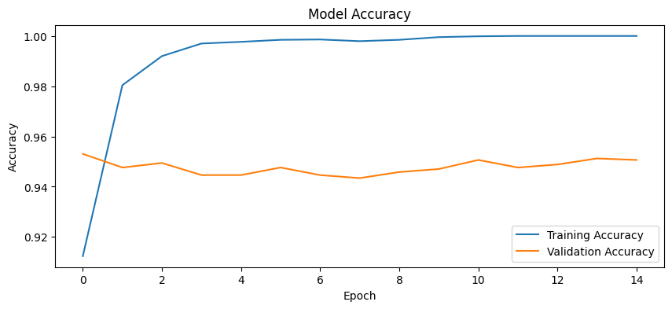
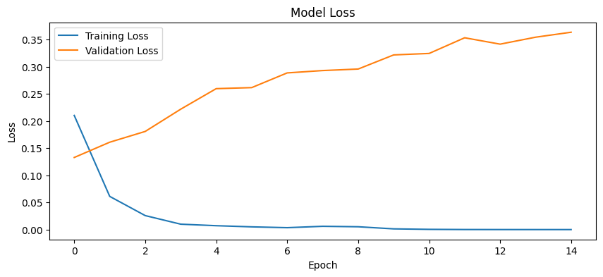

# Fake News Detection Using a Neural Network

## Overview

The rapid spread of misinformation across digital platforms has made automated fake news detection an important challenge in modern data science. This project presents a **Neural Network–based text classification system** capable of predicting whether a news headline is **real or fake**.

The model learns linguistic patterns from a dataset of labeled headlines and predicts the authenticity of unseen news. By transforming textual data into numerical representations and training a neural network classifier, the system can identify patterns commonly associated with misinformation.

This project demonstrates the practical application of neural networks, including **model architecture design, activation functions, loss functions, and optimization techniques**.

---

## Dataset

The dataset used in this project contains two columns:

| Column    | Description                         |
| --------- | ----------------------------------- |
| **text**  | News headline or short news content |
| **label** | Classification label                |

Label definitions:

* **0 → Real News**
* **1 → Fake News**

The dataset was obtained from **Kaggle**, a widely used platform for machine learning datasets. Prior to training, the dataset was explored to understand its structure and ensure that missing values were removed.

---

## Methodology

### Data Exploration

The dataset was loaded and explored using **Python** and **Pandas**. Initial analysis included displaying sample rows, checking dataset size, and observing the distribution of fake versus real news samples.

### Text Preprocessing

Since neural networks cannot directly process raw text, the headlines were converted into numerical representations using **TF-IDF (Term Frequency–Inverse Document Frequency)**. This technique transforms each headline into a vector that reflects the importance of words within the dataset.

TF-IDF helps the model focus on informative words while reducing the impact of very common words that carry little predictive value.

### Dataset Splitting

To evaluate the model's ability to generalize to unseen data, the dataset was split into two subsets:

* **80% Training Data**
* **20% Testing Data**

The training set was used to train the neural network, while the testing set was reserved for evaluating the final model performance.

---

## Neural Network Architecture

A **Feedforward Neural Network** was implemented using **TensorFlow/Keras** for binary text classification.

The model architecture consists of:

Input Layer → Hidden Layer → Hidden Layer → Output Layer

Detailed configuration:

| Layer          | Neurons             | Activation Function |
| -------------- | ------------------- | ------------------- |
| Input Layer    | TF-IDF feature size | —                   |
| Hidden Layer 1 | 128                 | ReLU                |
| Hidden Layer 2 | 64                  | ReLU                |
| Output Layer   | 1                   | Sigmoid             |

The **ReLU (Rectified Linear Unit)** activation function was used in the hidden layers because it efficiently introduces non-linearity and allows the network to learn complex relationships within the data.

The **Sigmoid activation function** was used in the output layer because the problem is a **binary classification task**. Sigmoid outputs a probability value between 0 and 1, representing the likelihood that a headline belongs to the *fake news* class.

---

## Model Training

The neural network was trained using the following configuration:

| Parameter     | Value               |
| ------------- | ------------------- |
| Optimizer     | Adam                |
| Loss Function | Binary Crossentropy |
| Epochs        | 15                  |
| Batch Size    | 32                  |
| Learning Rate | 0.001               |

Training the model for **15 epochs** allowed the neural network to iteratively adjust its internal weights through backpropagation, gradually improving its ability to distinguish between fake and real news headlines.

---

## Model Evaluation

After training, the model was evaluated using the test dataset to measure how well it performs on unseen data.

The primary evaluation metric used was **accuracy**, along with the model’s loss value.

Example result:

```
Test Accuracy: 0.92 (92%)
```

This result indicates that the neural network is capable of correctly classifying the majority of news headlines in the dataset.

---

## Results and Visualization

To better understand the learning behavior of the neural network, the model’s performance was visualized during training.

### Model Accuracy



The accuracy graph illustrates how the model’s predictive performance improves as training progresses.

### Model Loss



The loss curve shows how the model error decreases as the neural network optimizes its internal parameters.

These training curves indicate that the model successfully learns patterns from the dataset while maintaining reasonable generalization performance.

---

## Example Predictions

Example 1

Input:

```
Scientists confirm water on Mars.
```

Prediction:

```
Real News
```

Example 2

Input:

```
Secret government project creates invisible humans.
```

Prediction:

```
Fake News
```

These examples demonstrate how the trained neural network can analyze unseen headlines and classify them based on patterns learned during training.

---

## Project Structure

```
fake-news-detection/
├── app/                     # Source code directory
│   ├── app.py               # Streamlit application
│   ├── main.py              # CLI orchestration script
│   ├── model.py             # Neural Network architecture
│   ├── preprocess.py        # Text cleaning and vectorization
│   ├── data_loader.py       # Data loading utilities
│   ├── train.py             # Training loop logic
│   ├── evaluate.py          # Evaluation metrics and plotting
│   └── utils.py             # Artifact persistence (save/load)
├── requirements.txt         # Project dependencies
├── runtime.txt              # Python version (3.11)
├── README.md
└── .gitignore
```

---

## How to Run

### 1. Training the Model
To train the model from the root directory, run:
```bash
python -m app.main path/to/your/dataset.csv
```

### 2. Running the Web App
To start the TruthScanner AI interface:
```bash
streamlit run app/app.py
```

---

## Technologies Used

* Python
* Pandas
* Scikit-learn
* TensorFlow / Keras
* Google Colab

These tools were used for data preprocessing, neural network development, model training, and evaluation.

---

## Conclusion

This project demonstrates how neural networks can be applied to solve a real-world **natural language processing** problem. By combining TF-IDF text representation with a feedforward neural network, the model successfully learns patterns that distinguish fake news from legitimate information.

The results highlight the potential of machine learning techniques for combating misinformation and improving the reliability of digital information sources.

